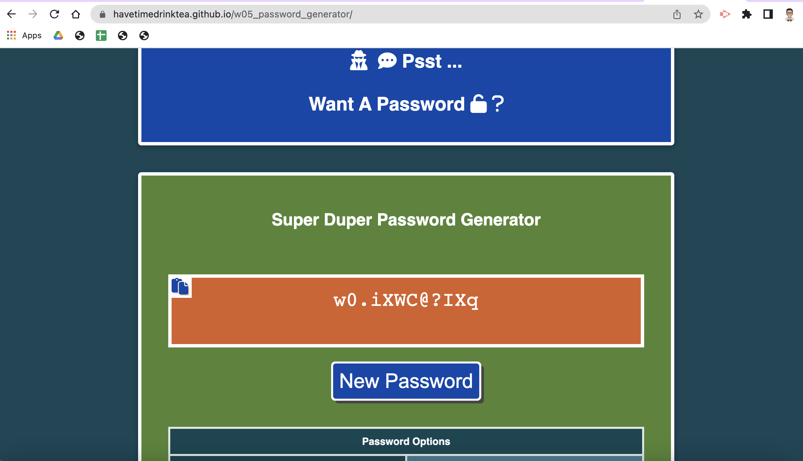

# w06_JS_Code_Quiz

## Description

This project is part of the Frontend Dev Bootcamp course challenge for the sixth week "Working with Web APIs". 

It requires us to use JScript objects, client-side storage, browser events to build a timed quiz of Jscript questions. The MCQ quiz should present the questions to the user. When the user clicks on one of the multiple choice answers, the quiz should check store the results and move on to the next question.  If the user give a wrong answer then the quiz time is to be reduced as a penalty. 

The JScript will produce the output dyanmically to the webpage pages as part of the starter code provided. I've tried to group repeatedly called Jscript codes into modular functions where possible.

### Methodology: Pseudo Code
* Create a function to generate Confirm dialog boxes to ask user for inputs(password length and choice of character sets) when a button is pressed
* Store user inputs into variables.
* Conduct user input validation such that 
  * password length to be between 10 and 64 (inclusive) and 
  * at least one of the 4 character sets (numeric, special, lower case and upper case letters) must be included. Use the default parameters where necessary.
* Create functions to
  * create a main array of character sets based on user/default inputs, 
  * randomly sort this main array using the Fisher-Yates method, 
  * for each character in the password, generate a random integer that will pick up a character from this main array and 
  * concatenate each character to form the desired password.
* Return the generated password to the web page
* Display default/user password generating input parameters on the webpage 
  * on page load (display default inputs) and 
  * when the button to generate password is clicked (display user inputs and where they fail the validation tests then display the default input parameters).

### Further Improvements

* to use bootstrap modal component to display the default (not visually appealing) Confirm dialog boxes. This allows me to style the modal boxes.
* The copy button uses document.execCommand that is deprecated. Need to do further research on Clipboard API.
* Check for user accessibility and load speed.

## User Story

AS A coding boot camp student

I WANT to take a timed quiz on Javascript fundamentals that stores high scores 

SO THAT I can guage my progress compared to my peers.

[Deployment link](https://havetimedrinktea.github.io/w06_JS_Code_Quiz/)

## Acceptance Criteria

GIVEN I am taking a code quiz
WHEN I click the start button
THEN a timer starts and I am presented with a question
WHEN I answer a question
THEN I am presented with another question
WHEN I answer a question incorrectly
THEN time is subtracted from the clock
WHEN all questions are answered or the timer reaches 0
THEN the game is over
WHEN the game is over
THEN I can save my initials and score

## Table of Contents (Optional)

* [Installation](#installation)
* [Usage](#usage)
* [Credits](#credits)
* [License](#license)
* [Features](#features)

## Installation

N.A.

## Usage 

Screen dump of the submitted webpage:

## Credits

* Customize copy textarea content code from [Morhero](https://codepen.io/MORHERO/pen/JLPzyB).  Please note that this code uses document.execCommand which is deprecated and I will need to do further research on Clipboard API instead.
* Randomly sort an array using the Fisher-Yates method [W3Schools - JavaScript Sorting Arrays](https://www.w3schools.com/js/js_array_sort.asp)

## License 

MIT License

## Features

### Main Features
* an online password generator on a styled webpage
* show the user a randomly generated password based on the default parameters on page load
* allow a user to generate a randomly generated password based on user's choice of 
  * password length and character set(s) by clicking a button.
  * check user parameter inputs: 
    * password length has to be an integer otherwise the default number of 12 will be used
    * password length has to be between 10 and 64 inclusive 
    * include at least one of the 4 character sets has to be chosen otherwise all the 4 character sets will be taken as default.
* Prepare a main array of the character set(s).
* Randomly sort the array using the Fisher-Yates method
* Generate a random number to be used as the index to the sorted array to pick up a character
* Concatenate each character to form the password of desired length.
* Display the password to the webpage textarea.

### Extra Features
* Generate a password on page load based on default parameters
* Copy button in the textarea for user to copy the password to clipboard. [See Further Improvements](#description)
* Styled the webpage and included contact details.

