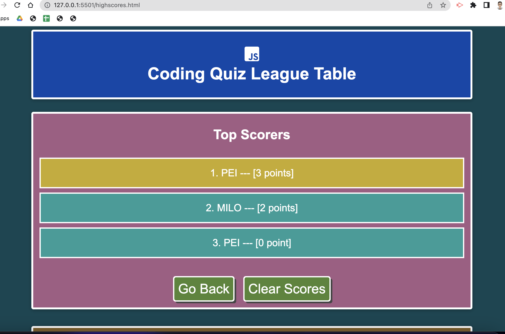

# w06_JS_Code_Quiz

## Description

This project is part of the Frontend Dev Bootcamp course challenge for the sixth week "Working with Web APIs". 

It requires us to use JScript objects, client-side storage, browser events to build a timed quiz of Jscript questions. The MCQ quiz should present the questions to the user. When the user clicks on one of the multiple choice answers, the quiz should check store the results and move on to the next question.  If the user give a wrong answer then the quiz time is to be reduced as a penalty. 

The JScript will produce the output dyanmically to the webpage pages as part of the starter code provided. I've tried to group repeatedly called Jscript codes into modular functions where possible.

***To make it easier to evaluate this application, I have deliberately set the quiz to take only 3 questions from a question bank of 20 and to allow a total of 18 seconds to answer them.*** The application is coded in such a way these parameters can be changed easily.

### Methodology: Pseudo Code
* Prepare a question bank in an array of objects. Each question and answer pair is to be created as an object.
* Ensure that questions in each quiz are not repeated
* Prepare functions for the following features:
  * a timer that has checks for quiz completion and will end quiz if user has not complete before the time limit.
  * check user answer and store the score 
  * if the user input a wrong answer, timer will be affected by reducing the time by 3 seconds.
  * add event listeners for the start and restart quiz buttons and also when user clicked a mcq answer.

### Further Improvements

* To allow users to input the number of questions to be included in a quiz and / or the amount of time allowed or each question. This can be implemented using FORM and event listeners in the homepage. 
* To set up an even larger bank of questions or categories of questions.
* Add a quit button to quit the quiz at any time.
* Add a Spaced Repetition System learning mechanism to this quiz application. 

## User Story

AS A coding boot camp student

I WANT to take a timed quiz on Javascript fundamentals that stores high scores 

SO THAT I can guage my progress compared to my peers.

[Deployment link](https://havetimedrinktea.github.io/w06_JS_Code_Quiz/)

## Acceptance Criteria

GIVEN I am taking a code quiz

WHEN I click the start button
THEN a timer starts and I am presented with a question

WHEN I answer a question
THEN I am presented with another question

WHEN I answer a question incorrectly
THEN time is subtracted from the clock

WHEN all questions are answered or the timer reaches 0
THEN the game is over

WHEN the game is over
THEN I can save my initials and score

## Table of Contents (Optional)

* [Installation](#installation)
* [Usage](#usage)
* [Credits](#credits)
* [License](#license)
* [Features](#features)

## Installation

N.A.

## Usage 

Screen dump of the submitted webpages:

### Quiz Home Page

### Question Page Demo 1

### Question Page Demo 2

### Quiz End Page

### Quiz High Scores League Table

## Credits

* JavaScript quiz questions taken from [interviewbit.com](https://www.interviewbit.com/javascript-mcq/).

## License 

MIT License

## Features

### Main Features
* A styled homepage with dynamically displayed quiz section at the click of a button
  * Each quiz has 3 questions and a total of 18 seconds to complete. 
  * The quiz questions are selected from a quiz bank of 20 questions and each question will not be repeated in each quiz
  * Upon clicking an answer, the user is presented with the next question until there are no more questions or that the time has run out.
  * When the user selects the wrong answer, the total time left will be reduced by 2 seconds. This penalty information will be shown when the quiz completes.
  * a correct answer audio and an incorrect answer audio is played when the user selects a right or wrong answer respectively.
* At the end of the quiz, the user is
  * presented with a custom message about their score
  * given the option to submit their name and the current score for adding to the league table. The league table stores top 3 users held in the client side local storage area.
    * If the current score is less than the lowest score in the client side local storage, then the user is presented with the appropriate message.
    * If the score is higher than the lowest score held, then it will be inserted into the league table with the previous low score being removed.
    * If there are less than 3 scores in the league table, then the user's current score will be inserted into the league table.
* Users can view the high scores league table by clicking on the High Score link at the top of the home page  

